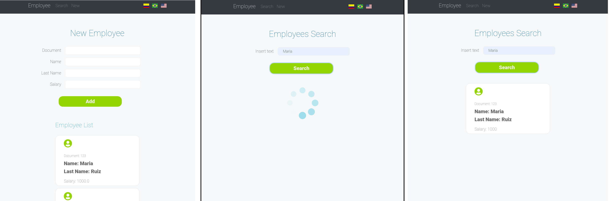
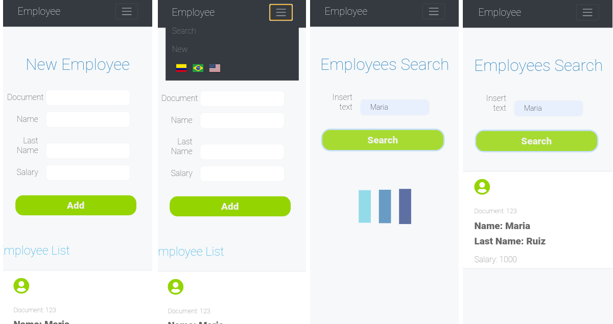

# Employees app

:rocket: A demo of this project is available [here](http://mafda-django-employees.herokuapp.com/).

***Employees App***  is a project that has the following features:

* In the **Search Tab**, you can realize an open search in the employees' list.
  * The application will perform a search of the term of interest in all the database fields and will return the list of matched employees.
  * To improve the user experience, a wait animation was implemented. A spin and a bar pulse animations were used for desktop and mobile applications, respectively.
  * To better appreciate those animations, a database response delay of 1 second was simulated.
* In the **New Tab**, you can visualize the complete employees' list with document number, name, last name, and salary data.
  * Here, it is possible to create new employees too.
  * The app will verify the document number to avoid data entry redundancy.
    * I.e., it is possible to have two employees with the same name but not two employees with the same document number.
* It is possible to choose the interface idiom between Spanish, Portuguese, and English.
  * The default language will depend on your location. 

## Technologies

* The project was developed using the framework [Django](https://www.djangoproject.com/) with [Python 3](https://www.python.org/).
* HTML was used to create the layouts templates.
* CSS and [Bootstrap](https://getbootstrap.com/) were used for the basic styling of the navbar, forms, and other components.
* [Font Awesome](https://fontawesome.com/) and [Google Fonts](https://fonts.google.com) were used for complementary styling.
* To have a better user experience, JavaScript and [AJAX](https://api.jquery.com/jquery.ajax/) were used to manage the client requisitions and interface events.  
* The multiple application languages were managed with the feature of [internationalization and localization](https://docs.djangoproject.com/en/3.0/topics/i18n/) of Django.
* Finally, [Heroku](www.heroku.com) was used to deploy the project.
  
## Screenshots

### Web



### Mobile



## Development 

```shell
# 1. Create the virtual environment
python -m venv /path/to/new/virtual/environment

# 1.1. Activate it
source /path/to/new/virtual/environment/bin/activate

# 2. Clone the project
git clone https://github.com/mafda/django_employees.git

# 2.1. Go to the project directory
cd django_employees

# 3. Install the project dependencies
pip install -r requirements.txt

# 4. Make database migrations
python manage.py migrate

# 5. Run the server
python manage.py runserver

# 6. Enjoy it!
echo "well done! :)"
```

Done! Now navigate to http://localhost:8000/


### Heroku deploy 

```shell
# 1. Create the app on Heroku 
heroku create awesome-employees-app

# 2. Deploy it :)
git push heroku master

# 3. Make database migrations
heroku run python manage.py migrate

# 4. Enjoy it!
echo "well done! :)"
```

Done! Now navigate to https://awesome-employees-app.herokuapp.com/

> The application link will depend on the application name registered on Heroku.

## License

[](https://opensource.org/licenses/MIT)

---

**</>** with 💙 by [mafda](https://mafda.github.io/).

